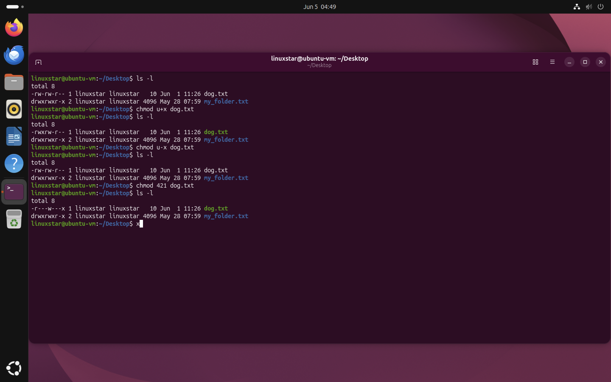
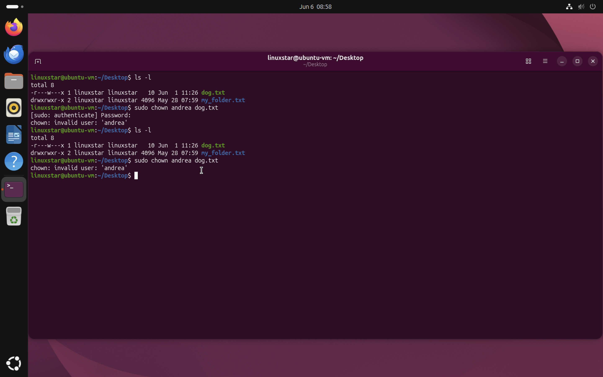
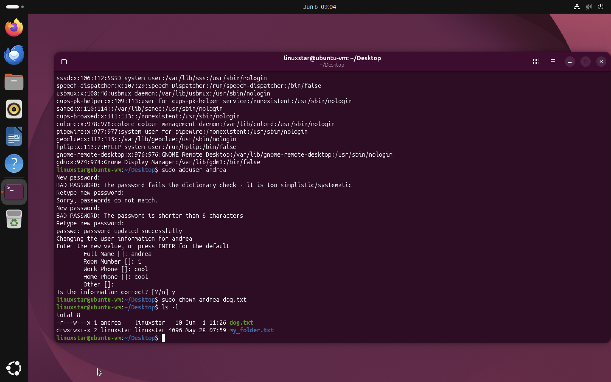

# Linux File Permissions and Ownership
Managing authorization is one of the key factors to insure security of an organisation. Security professionals ensure that the users must be authorized with appropriate permissions. This repository provides a comprehensive guide to understanding file permissions and ownership in Linux systems. It includes practical use of chmod and ls -al commands to change permissions on files.

### Types of File Permissions :

* **Read (r):** Allows viewing the contents of a file.
* **Write (w):** Allows modifying the contents of a file.
* **Execute (x):** Allows running a file (if it's a script or program) or accessing a directory's contents.
  
### Types of File Ownership
* **Owner:** The user who created the file.
* **Group:** A group of users who have shared access to the file.
* **Others:** All other users on the system.

### Permission representation : 
Permisiion includes 10 characters..> **drwxrwxrwx**
- **First character** : d represents the directory  - repersents file
- **2nd to 4th charcters** : write, read and execute permissions for user
- **5th to 7th charaters** : write, read and execute permissions for group
- **8th to 10th characters** : write, read and execute permissions for others
  
| Permission String | Type | Description |
|------------------|------|-------------|
| `drwxrwxrwx` | Directory | Owner, group, and others have read, write, and execute permissions. |
| `-rwxrwxrwx` | File | Owner, group, and others have read, write, and execute permissions. |
| `--wxrwxrwx` | File | Owner lacks read permission. |
| `---xrwxrwx` | File | Owner lacks read and write permissions. |
| `----rwxrwx` | File | Owner has no permissions. |
| `-----wxrwx` | File | Group lacks read permission. |
| `------xrwx` | File | Group lacks read and write permissions. |
| `-------rwx` | File | Group has no permissions. |
| `--------wx` | File | Others lack read permission. |
| `---------x` | File | Others lack read and write permissions. |
| `----------` | File | Others have no permissions. |

We can also represent permissions numerically. Numeric notation is faster and easier to apply permissions than specifying each permission individually.
Numerical value for permissions is following:
 - **Read (r)**    4
 - **Write (w)**   2
 - **Execute (x)** 1

The values are added together to create permission sets.


| Numeric Value | Permission | Meaning              |
| ------------- | ---------- | -------------------- |
| 7             | rwx        | Read, Write, Execute |
| 6             | rw-        | Read, Write          |
| 5             | r-x        | Read, Execute        |
| 4             | r--        | Read Only            |
| 0             | ---        | No Permissions       |

### Common Permission Sets

| Numeric Value | Permissions | Description                                                  |
| ------------- | ----------- | ------------------------------------------------------------ |
| 777           | rwxrwxrwx   | Full permissions for everyone                                |
| 755           | rwxr-xr-x   | Owner has full access, group and others can read and execute |
| 700           | rwx------   | Only the owner has access                                    |
| 644           | rw-r--r--   | Owner can read and write, others can only read               |
| 600           | rw-------   | Only the owner can read and write                            |
| 421           | r---w---x   | Owner can read, group can write, others can execute          |

# Managing Linux File Permissions with `chmod`
Used to modify file permissions.  Offers a symbolic or numeric mode to set permissions.
  **Symbolic Mode**: Uses letters and symbols to represent permissions and users.
u: User (owner)
g: Group
o: Others
a: All (user, group, and others)
+: Add permission
-: Remove permission
=: Set permission

### Viewing Current Permissions

Before modifying permissions, they can be viewed using:

```bash
ls -l
```

Example:

```text
-rw-rw-r-- dog.txt
```
### Adding Execute Permission

```bash
chmod u+x dog.txt
```

This command adds execute permission for the file owner.

### Removing Execute Permission

```bash
chmod u-x dog.txt
```

This command removes execute permission from the file owner.

## Using Numeric Permissions

```bash
chmod 421 dog.txt
```

This assigns:

* Owner = Read (4)
* Group = Write (2)
* Others = Execute (1)

Result:

```text
-r---w---x
```

## Practical Demonstration



*Figure 1: Modifying file permissions using symbolic and numeric chmod syntax.*

In this example:

* `chmod u+x dog.txt` adds execute permission to the owner.
* `chmod u-x dog.txt` removes execute permission from the owner.
* `chmod 421 dog.txt` applies custom permissions using numeric notation.
* `ls -l` is used to verify the permission changes after each command.

# Managing File Ownership with chown

In Linux, every file and directory has an owner and a group. The `chown` command is used to change file ownership and is commonly used by administrators to manage access to files and system resources.

### Viewing Current Ownership

File ownership can be displayed using:

```bash
ls -l
```

Example:

```text
-r---w---x 1 linuxstar linuxstar 10 Jun 1 11:26 dog.txt
```
* Owner = `linuxstar`
* Group = `linuxstar`


### Changing Ownership

I attempted to change ownership of `dog.txt` to a user named `andrea`. However, the command failed because the user account did not exist on the system.

```bash
sudo chown andrea dog.txt
```
Output:

```text
chown: invalid user: 'andrea'
```



*Figure 1: Attempting to change file ownership to a user that does not exist on the system.*


### Creating a New User

To resolve the issue, I created a new user account:

```bash
sudo adduser andrea
```

### Changing File Ownership

The ownership of `dog.txt` was changed using:

```bash
sudo chown andrea dog.txt
```
The ownership was verified using:

```bash
ls -l
```

Output:

```text
-r---w---x 1 andrea linuxstar 10 Jun 1 11:26 dog.txt
```




*Figure 2: Creating a new user and successfully changing file ownership using the chown command.*


## Cybersecurity Relevance

File ownership is an important security control in Linux systems. Proper ownership management helps ensure that only authorized users can modify or manage files. Misconfigured ownership may lead to unauthorized access or accidental modification of sensitive data.

## What I Learned

- Every file in Linux has an owner and a group.
- `chown` is used to change file ownership.
- The target user must exist before ownership can be assigned.
- `adduser` can be used to create new user accounts.
- `ls -l` can be used to verify ownership and permissions.
- `chmod` is used to modify file permissions for owners, groups, and others.
- `chmod` supports both symbolic notation (`u+x`, `g-w`) and numeric notation (`755`, `644`, `421`).
- Proper ownership and permission management are important security controls in Linux systems.
