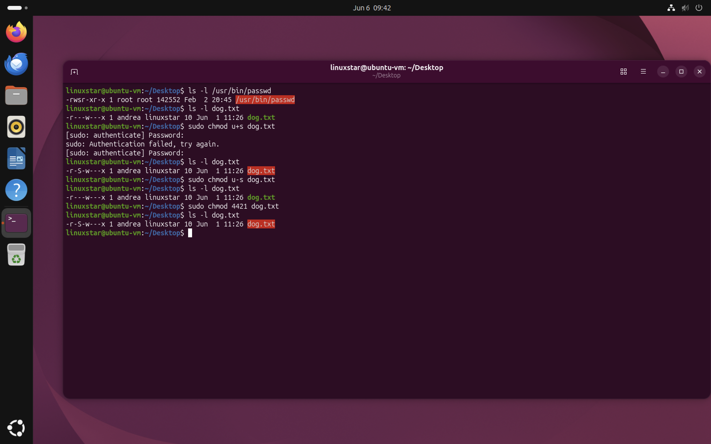
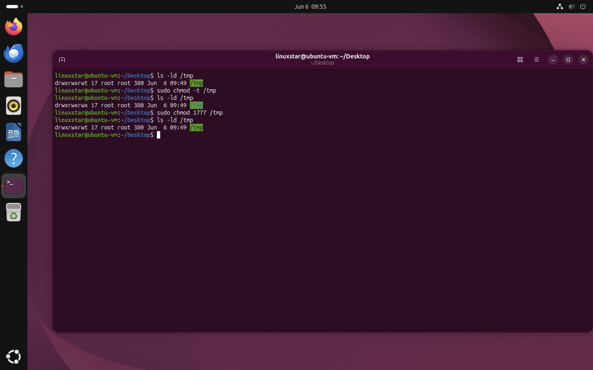

# SetUID, SetGID, and Sticky Bit
Linux provides three special permissions in addition to the standard read (`r`), write (`w`), and execute (`x`) permissions:

- SetUID (SUID)
- SetGID (SGID)
- Sticky Bit

These special permissions affect how programs and directories behave when accessed by users. They are commonly used in Linux system administration and are important concepts in cybersecurity.
#### Numeric Representation

| Permission | Value |
|------------|--------|
| SetUID | 4 |
| SetGID | 2 |
| Sticky Bit | 1 |

## SetUID (SUID)

### Purpose

SetUID allows a program to run with the permissions of the file owner instead of the user executing it.
For example, normal users cannot directly modify `/etc/shadow`. However users can change their own passwords using the `passwd` command because the program runs with root privileges.

```bash
ls -l /usr/bin/passwd
```

The `s` in the owner's execute position indicates that SetUID is enabled.



*Figure 1: Viewing the SetUID permission on the passwd command.*


#### Enable SetUID

```bash
sudo chmod u+s dog.txt
```

#### Remove SetUID

```bash
sudo chmod u-s dog.txt
```

#### Numeric Value

```bash
sudo chmod 4421 dog.txt
```

The leading **4** enables SetUID.


## SetGID (SGID)
SetGID allows files to run with the permissions of the file's group. When applied to a directory, newly created files inherit the directory's group ownership. This is useful for shared project folders where multiple users collaborate.

#### Example

```text
drwxrwsr-x
```
The `s` in the group execute position indicates that SetGID is enabled.

#### Enable SetGID

```bash
sudo chmod g+s directory
```

#### Remove SetGID

```bash
sudo chmod g-s directory
```

#### Numeric Value

```bash
sudo chmod 2755 directory
```

The leading **2** enables SetGID.


## Sticky Bit

The Sticky Bit prevents users from deleting files owned by other users inside a shared directory.

### Example

```bash
ls -ld /tmp
```


*Figure 2: Viewing the Sticky Bit on the shared /tmp directory.*
Example output:

```text
drwxrwxrwt 17 root root 380 jun 6 09:49 tmp
```

The `t` at the end indicates that the Sticky Bit is enabled.

#### Why It Is Important

The `/tmp` directory is shared by all users. Without Sticky Bit User A could delete User B's files and with Sticky Bit Users can only delete files that they own.

#### Enable Sticky Bit

```bash
chmod +t directory
```

#### Remove Sticky Bit

```bash
chmod -t directory
```

#### Numeric Value

```bash
chmod 1755 directory
```

The leading **1** enables the Sticky Bit.
