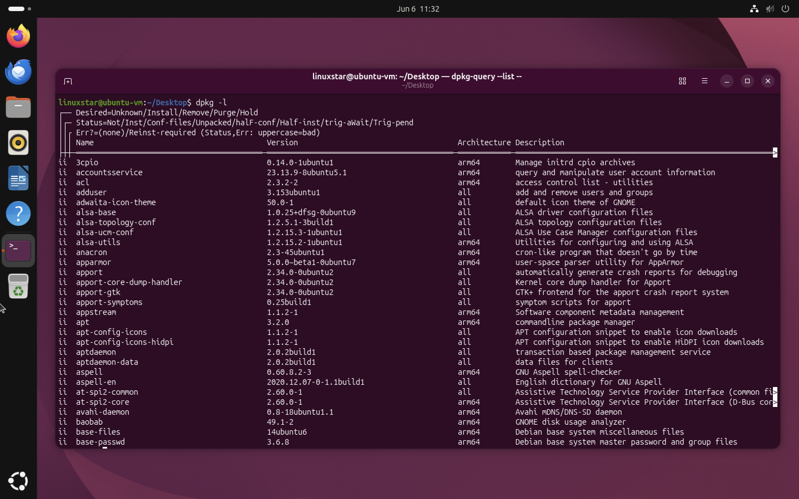

# Linux Package Management with dpkg

Linux distributions use package management systems to install, update, and remove software. Ubuntu commonly distributes software using .deb packages. These packages are used to install software after which the program files are extracted into various system directories. A `.deb` file contains:

- Program files
- Configuration files
- Dependency information
- Installation scripts

## `dpkg` Command

`dpkg` is the low-level package manager used by Debian-based Linux distributions.

It can:

- Install packages
- Remove packages
- List installed packages
- Display package information

### Listing Installed Packages

```bash
dpkg -l
```
The screenshot below shows installed packages on my Ubuntu VM.



*Figure 1: Listing installed packages using the `dpkg -l` command.*

### Installing a Package

To install a package we use flag `-i`. 
```bash
sudo dpkg -i package_name.deb
```

Example:

```bash
sudo dpkg -i vscode.deb
```

### Removing a Package

To remove an installed package we usr `-r` flag.

```bash
sudo dpkg -r package_name
```

Example:

```bash
sudo dpkg -r nginx
```

# Linux Package Dependencies and APT
Most Linux applications rely on additional software **dependencies**. Modern Linux package managers help manage these dependencies automatically.  When we download package with `apt` command it automatically downloads the dependencies unlike `dpkg` where we need to download the dependencies as well.

## Dependency Management with APT

APT (Advanced Package Tool) is the default package manager used by Ubuntu and other Debian based distributions.

When installing a package using APT:

```bash
sudo apt install package-name
```

APT automatically:

* Downloads the requested package.
* Identifies required dependencies.
* Downloads missing dependencies.
* Installs everything in the correct order.

## Fixing Missing Dependencies

If DPKG reports dependency problems APT will attempt to download and install any missing dependencies required by the package. they can often be resolved using following command.

```bash
sudo apt --fix-broken install
```

## Shared Libraries

Instead of every application storing its own copy of a library, multiple applications can share the same library. It is located in directories such as:

```text
/lib
/usr/lib
```
## Package Repositories

A package repository is a server that stores software packages and their metadata. Linux package managers use repositories to download and install software.

Ubuntu stores repository information in:

```bash
/etc/apt/sources.list
```

This file contains the repository locations that APT uses when searching for software packages and updates.

Administrators can view the configured repositories using:

```bash
cat /etc/apt/sources.list
```

## Personal Package Archives (PPAs)

A Personal Package Archive (PPA) is a software repository created by individuals or organizations to distribute software packages outside the official Ubuntu repositories.

PPAs can provide:

* Newer software versions
* Additional applications
* Software not available in official repositories

However, PPAs should be used carefully because they are not always reviewed to the same standard as official Ubuntu repositories.

Potential risks include:

* Unstable software
* Compatibility issues
* Security vulnerabilities
* Malicious software

## Updating Repositories

Repository managers regularly update software packages and security patches. Before installing or upgrading software, it is good practice to refresh the local package index:

```bash
sudo apt update
```

This command downloads the latest package information from configured repositories.

To upgrade installed packages:

```bash
sudo apt upgrade
```

This installs the latest available versions of installed software.
