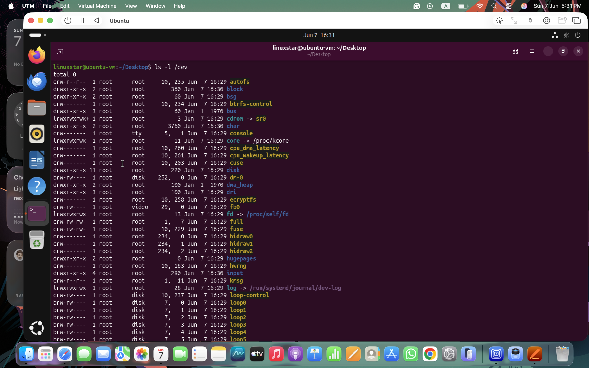
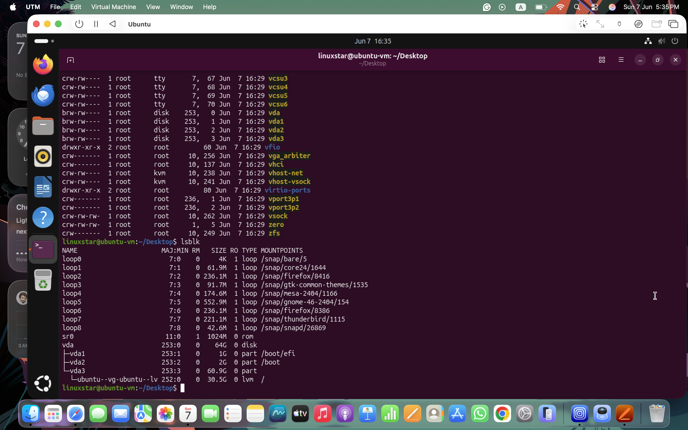

# Linux Devices and Drivers
Everything is considered a file in linux. When a device is connected to your computer, ​a device file is created in the /dev directory. Following command will give the list of devices in your linux. 
```bash
ls -l /dev
```

**Figure1**
The first bit of file permissions tells us which type of file is, Following table tells the different symbols that differentiate betweeen different type of files:
| Symbol | Type             | Description                                 |
| ------ | ---------------- | ------------------------------------------- |
| `-`    | Regular File     | Normal file containing data                 |
| `d`    | Directory        | Folder containing files                     |
| `l`    | Symbolic Link    | Shortcut pointing to another file           |
| `c`    | Character Device | Transfers data one character/byte at a time |
| `b`    | Block Device     | Transfers data in blocks                    |
| `p`    | Named Pipe       | Inter-process communication                 |
| `s`    | Socket           | Communication endpoint between processes    |
## Types of Linux Devices
Some of the Linux device categories include:
- **Block devices:** Devices that can hold data, such as hard drives, USB drives, and filesystems.
- **Character devices:** Devices that input or output data one character at a time, such as keyboards, monitors, and printers. 
- **Pipe devices:** Similar to character devices. However, pipe devices send output to a process running on the Linux machine instead of a monitor or printer.
- **Socket devices:** Similar to pipe devices. However, socket devices help multiple processes communicate with each other.

## Viewing Storage Devices with `lsblk`

The `lsblk` command displays information about block devices, partitions and mount points.

```bash
lsblk
```
Following                      
- NAME....        Device or partition name           
- MAJ:MIN....     Major and minor device numbers     
- RM ....          Removable device (0 = No, 1 = Yes) 
- SIZE ....        Device size                        
- RO ....         Read-only status                   
- TYPE ....        Device type                        
- MOUNTPOINT .... Where the filesystem is mounted    


**Figure2**
In my lab following is my devices list,
| Device                | Description                                   |
| --------------------- | --------------------------------------------- |
| vda                   | Main virtual disk (64 GB)                     |
| vda1                  | EFI System Partition                          |
| vda2                  | Boot Partition                                |
| vda3                  | Main Linux Partition                          |
| Ubuntu--vg-ubuntu--lv | Logical Volume containing the root filesystem |
| sr0                   | Virtual CD-ROM device                         |
| loop0-loop8           | Loopback devices used by Snap packages        |

#### `lsblk`
Displays available storage devices, partitions, and mount points.

Key observations:
- `vda` represents the virtual hard disk.
- `vda1`, `vda2`, and `vda3` are disk partitions.
- `/boot/efi`, `/boot`, and `/` show where the partitions are mounted.
- Several `loop` devices are used by Snap packages.

#### `lspci`
Lists PCI hardware devices detected by the system.

Examples shown:
- Host bridge
- Ethernet controller
- Display controller (VirtIO GPU)
- Audio controller
- USB controller
- Storage controller

This command is useful for identifying installed hardware and troubleshooting device issues.

#### `lsmod`
Displays currently loaded kernel modules (drivers).

Examples shown:
- `snd_hda_intel`
- `snd_hda_codec`
- `snd_seq`
- `snd_pcm`

These modules provide support for audio hardware and other system devices.
**NOTE:** A device is any hardware component managed by Linux, while a drive is a storage device used to store data. All drives are devices, but not all devices are drives.
