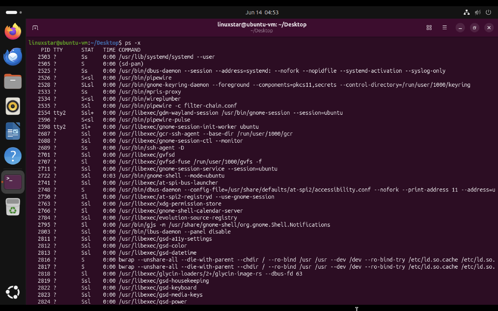
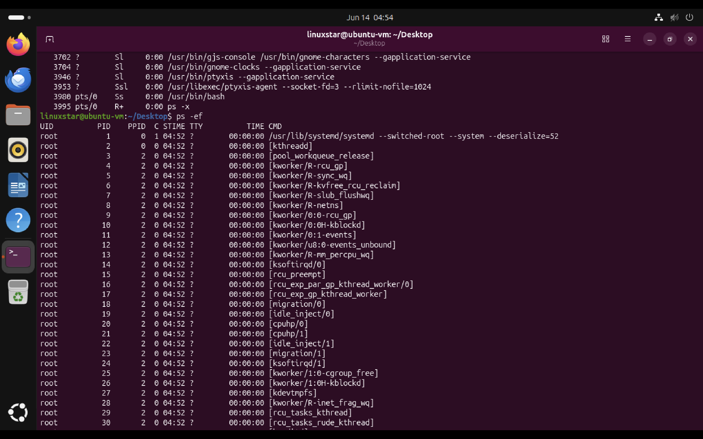
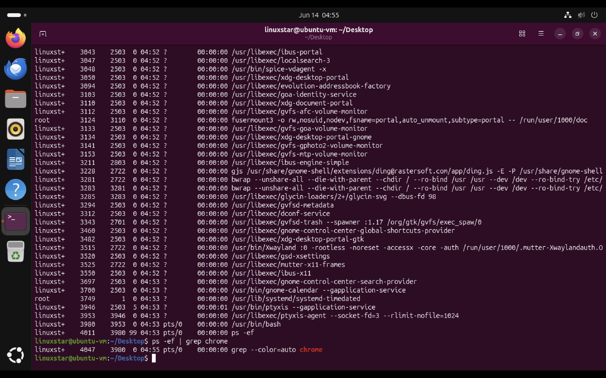
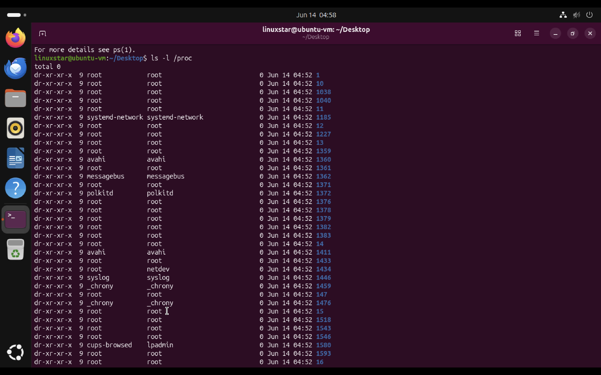
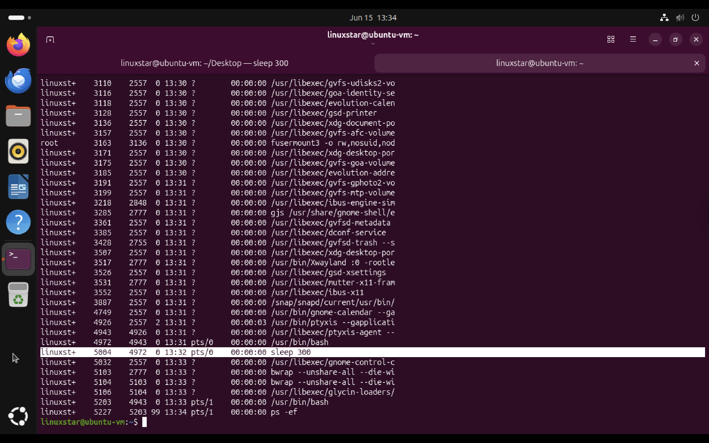
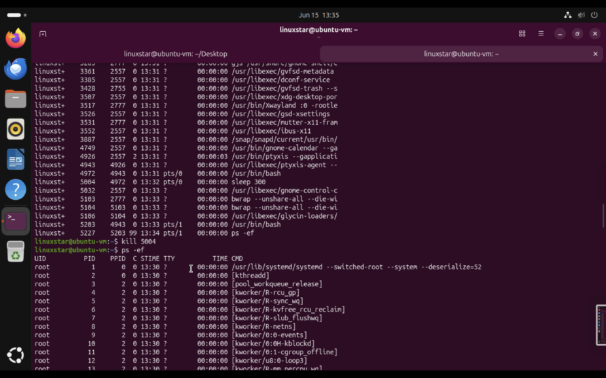
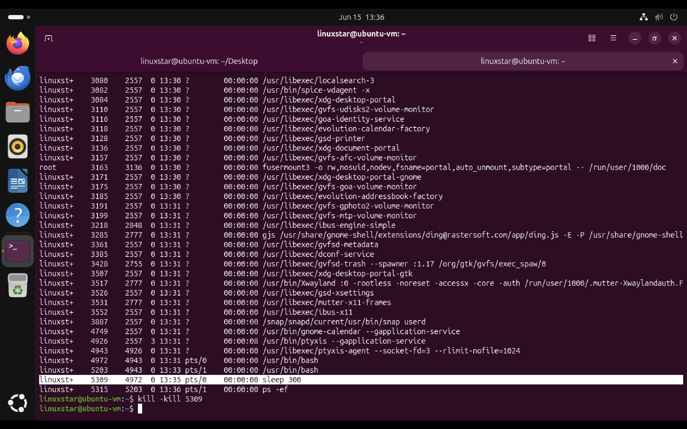
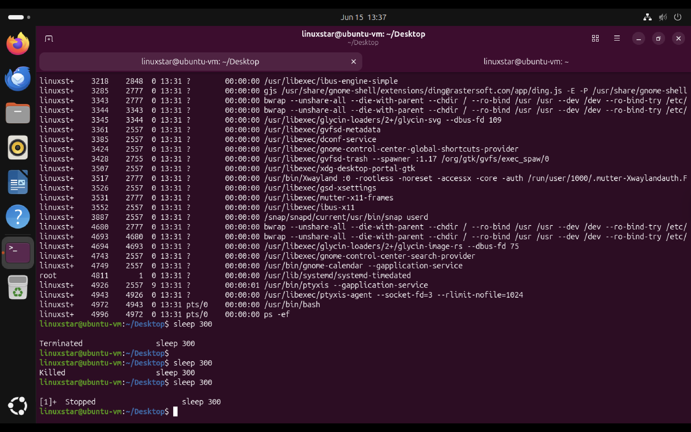

 # Linux Process Management 

Linux manages every running program as a process. Each process is assigned a unique Process ID (PID) and is managed by the Linux kernel. Understanding process management is essential for system administration, troubleshooting, performance monitoring and cybersecurity investigations. When you start up your computer, ​the kernel creates a process called **init** ​which has a PID of one. ​init starts up other processes ​that we need to get our computer up and running. During this lab, I explored process listing commands, parent-child process relationships, the Linux init process and the `/proc` filesystem.

## Understanding the Init Process

The first user-space process started by the Linux kernel during system boot is known as the **Init Process**.

Traditionally Linux used:

```bash
/sbin/init
```

Modern Linux distributions such as Ubuntu use:

```bash
systemd
```
It is responsible for following,

* Starting system services during boot
* Managing background daemons
* Handling service dependencies
* Adopting orphaned processes
* Coordinating system shutdown and reboot


## Viewing User Processes with `ps -x`

The `ps -x` command displays processes owned by the current user it also includes those processes that are not attached to a terminal session.

```bash
ps -x
```

### Screenshot



- Every running application is represented as a process.
- Each process has a unique PID.
- The `STAT` column shows the process state. Type of process status are following **R** for running it means the process is running or it's waiting to run. **T** for stopped meaning a process that's been suspended **S** S for interruptible sleep Meaning the task is waiting for an event ​to complete before it resumes
- The `COMMAND` column shows the  command being run.
- Many desktop environment services run in the background even when no applications are actively open.


## Viewing All Processes with `ps -ef`

The `ps -ef` command displays all processes currently running on the system. The **-e flag** is used to get all processes, ​even the ones run by other users. ​The **-f flag** is for full, ​which shows you full details about ​a process.

```bash
ps -ef
```

### Screenshot



### Important Columns

| Column | Description |
|----------|-------------|
| UID | User that owns the process |
| PID | Process ID |
| PPID | Parent Process ID |
| CMD | Command used to start the process |
|S   | time is the start time of the process|
|​TTY |the terminal associated with the process|
|​Time | total CPU time that the process has taken up|

- Every process has a parent process.
- Linux uses a hierarchical process structure.
- PID 1 is typically assigned to `systemd`.
- `systemd` is responsible for starting many services during system boot.


## Searching for Processes

Processes can be searched using `grep`.

```bash
ps -ef | grep chrome
```

### Screenshot



- `grep` filters process output.
- Useful for checking if a service or application is running.
- If the application is not running, only the `grep` process may appear.


## Exploring the `/proc` Filesystem

Everything in Linux is a file, even processes. ​To view the files that correspond to processes, ​we can look into the slash proc directory. ​There are a lot of directories here ​for every process that is running. ​If you look inside one of the subdirectories, ​it will  give more information about the process. Linux exposes process information through the virtual `/proc` filesystem.

```bash
ls -l /proc
```

### Screenshot



### What I Learned

The numbered directories represent active process IDs.

Examples:

```text
/proc/1
/proc/2503
/proc/3980
```

Each process directory contains information about that specific process. This allows administrators to inspect running processes directly through the filesystem.
Useful files include:

```text
/proc/<PID>/status
/proc/<PID>/cmdline
/proc/<PID>/fd
/proc/<PID>/maps
```


## Process IDs (PID)

Every process receives a unique Process ID.

Example:

```text
3980 = bash
```

The PID can be used to:

- Monitor processes
- Kill processes
- Investigate process behaviour


## Parent Process IDs (PPID)

Every process is created by another process.

Example:

```text
PPID 1 → systemd
PPID 3980 → bash
```

This relationship forms a process tree that shows how applications are launched and managed.


## Common Process States

| State | Meaning |
|---------|---------|
| R | Running |
| S | Sleeping |
| D | Uninterruptible Sleep |
| T | Stopped |
| Z | Zombie |


## Commands Practiced

```bash
ps -x
ps -ef
ps -ef | grep chrome
ls -l /proc
```


# Process Signals in Linux

Linux uses signals to communicate with running processes. Signals allow users and the operating system to stop, pause, resume, or interrupt processes.

### Common Signals

| Signal | Number | Purpose |
|----------|----------|----------|
| SIGTERM | 15 | Politely requests a process to terminate |
| SIGKILL | 9 | Forcefully terminates a process |
| SIGTSTP | 20 | Suspends a process |
| SIGCONT | 18 | Resumes a suspended process |
| SIGINT | 2 | Interrupts a process (Ctrl+C) |


## Creating a Process

I used `sleep` command  to create a simple process that remains active for 300 seconds.

```bash
sleep 300
```

The process ID (PID) was identified using:

```bash
ps -ef
```

### Evidence




## Terminating a Process with SIGTERM

The default `kill` command sends a SIGTERM signal. SIGTERM allows a process to clean up resources before shutting down.


```bash
kill 5004
```

### Evidence



## Forcefully Terminating a Process with SIGKILL

If a process refuses to stop, SIGKILL can be used. SIGKILL immediately terminates the process and does not allow cleanup operations.


```bash
kill -KILL 5309
```

### Evidence




## Suspending a Process Using SIGTSTP

A running process can be suspended using following keyboard shortcuts. This sends a SIGTSTP signal and places the process into a stopped state.

```text
Ctrl + Z
```

### Evidence




