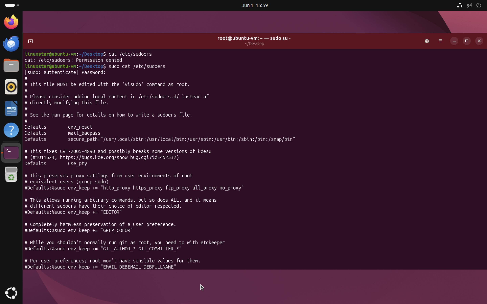
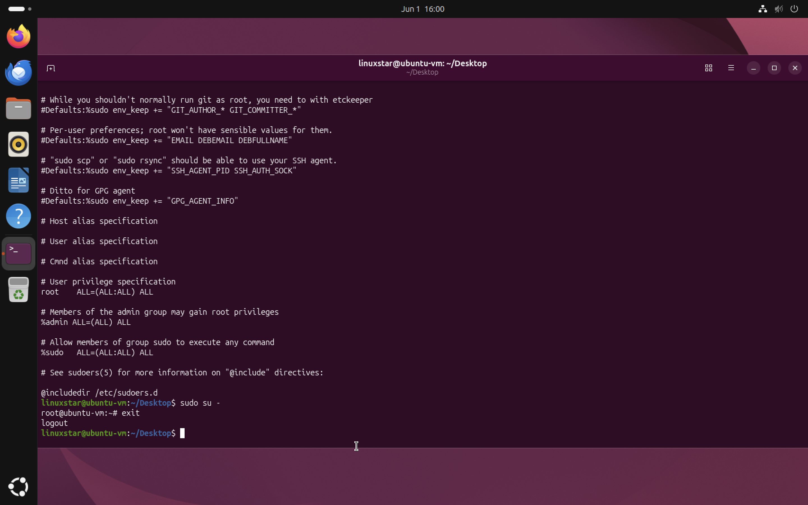

## Linux Users, Privileges, and Sudo

Linux follows the principle of least privilege. Regular users have limited permissions while administrative tasks require elevated privileges. `sudo` command provides these elevated privileges.
### Accessing Protected Files

The `/etc/sudoers` file controls which users are allowed to execute commands with elevated privileges.
Attempting to view the file without sufficient permissions results in an error:

```bash
cat /etc/sudoers
```

Output:

```text
Permission denied
```

To access the file, administrative privileges are required:

```bash
sudo cat /etc/sudoers
```


**Figure 1:** Viewing the `/etc/sudoers` file using elevated privileges.

### Switching to the Root Account

A user with sudo privileges can temporarily become the root user:

```bash
sudo su -
```

After authentication, the prompt changes:

```text
root@ubuntu-vm:~#
```

This indicates that commands are now being executed with full administrative privileges. it is not a good approoach to stay logged in as root all the time. ​There are lots of critical services and files that can be mistakenly changed. Therefore, we use `exit` command to logout.



**Figure 2:** Members of the sudo group can execute administrative commands and switch to the root account.


## Viewing Linux Users and Groups


Linux uses users and groups to control access to files, directories and system resources. Understanding how to view and manage users and groups is an important system administration and cybersecurity skill.

## Viewing Local Users

Linux stores user account information in the `/etc/passwd` file.

To display all local users:

```bash
cat /etc/passwd
```
Example of output:
```text
linuxstar:x:1000:1000:Linux User:/home/linuxstar:/bin/bash
```
Each entry follows this format:

```text
username:x:UID:GID:comment:home_directory:shell
```

| Field          | Description                 |
| -------------- | --------------------------- |
| Username       | Login account name          |
| UID            | User Identifier             |
| GID            | Primary Group Identifier    |
| Home Directory | User's personal directory   |
| Shell          | Default command interpreter |


## Displaying Usernames Only

To display only usernames:

```bash
cut -d: -f1 /etc/passwd
```
This command extracts the first field from each entry in `/etc/passwd`.

## Viewing Linux Groups

Linux stores group information in the `/etc/group` file.

To display all groups:

```bash
cat /etc/group
```

output:

```text
sudo:x:27:linuxstar
```
Each entry follows this format:

```text
group_name:x:GID:user_list
```

| Field      | Description          |
| ---------- | -------------------- |
| Group Name | Name of the group    |
| GID        | Group Identifier     |
| User List  | Members of the group |

In the example above the user `linuxstar` is a member of the `sudo` group.


## Why Users and Groups Matter

Linux uses users and groups to control access to system resources. such as
* Restricting access to sensitive files.
* Allowing administrative privileges through the `sudo` group.
* Separating users based on their responsibilities.
* Enforcing the principle of least privilege.

## Managing Passwords in Linux

`passwd` command is use for managing user account passwords. Password management is an important security practice because strong authentication helps protect systems from unauthorized access.

## Changing Your Own Password

A user can change their own password using:

```bash
passwd
```
After running the command, Linux prompts for:

```text
Current password
New password
Retype new password
```
The password is not displayed while typing.
## Changing Another User's Password

Administrative users can change the password of another account using following command,

```bash
sudo passwd username
```

## Forcing a Password Change at Next Login

Administrators can require a user to change their password the next time they sign in:

```bash
sudo passwd -e username
```
The `-e` option expires the current password immediately.

An alternative method is:

```bash
sudo chage -d 0 username
```
This forces the user to create a new password during their next login.

## The /etc/shadow File

Linux stores password hashes in the `/etc/shadow` file. Unlike `/etc/passwd`, the `/etc/shadow` file contains password hashes and password policy information.It is owned by the root user and is protected because it contains sensitive authentication information. Administrative privileges are required to open this file. Protecting this file is critical because exposure of password hashes may allow attackers to attempt offline password cracking attacks.

To view the file:

```bash
sudo cat /etc/shadow
```
## Cybersecurity Relevance

Password security is a fundamental component of system security.
Administrators use password policies to:
* Enforce strong authentication.
* Require password changes.
* Protect sensitive accounts.
* Reduce the risk of unauthorized access.
* Support security compliance requirements.


