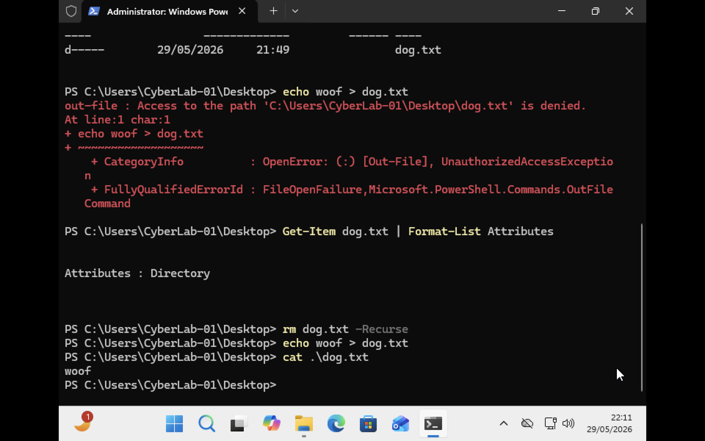
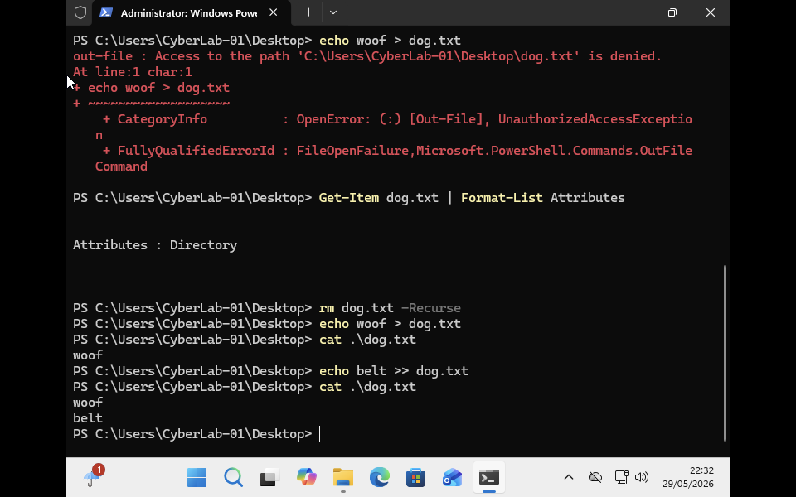
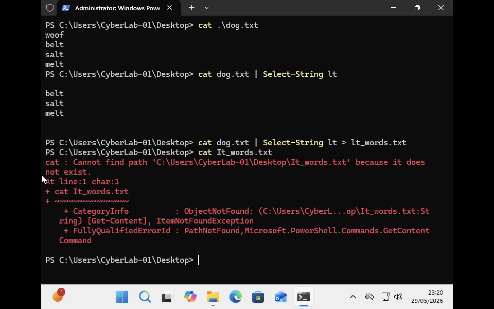
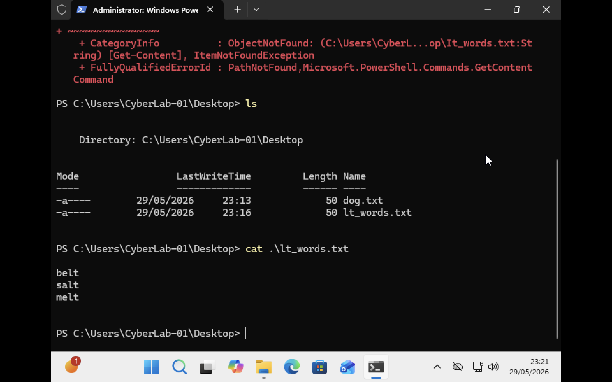
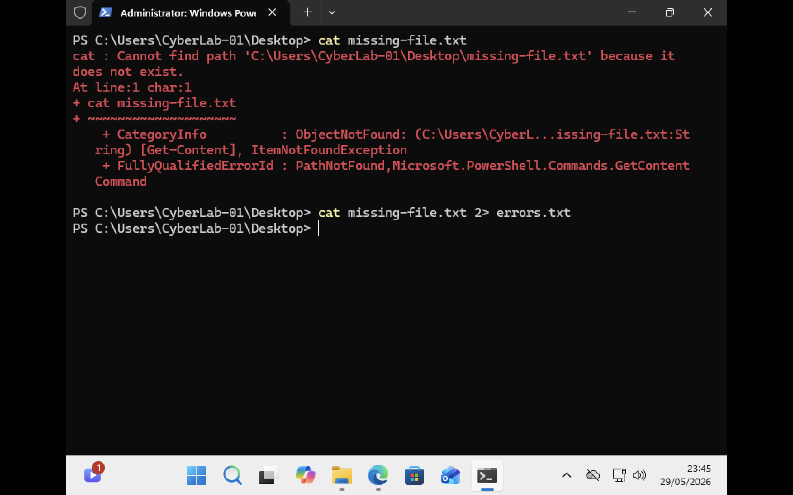
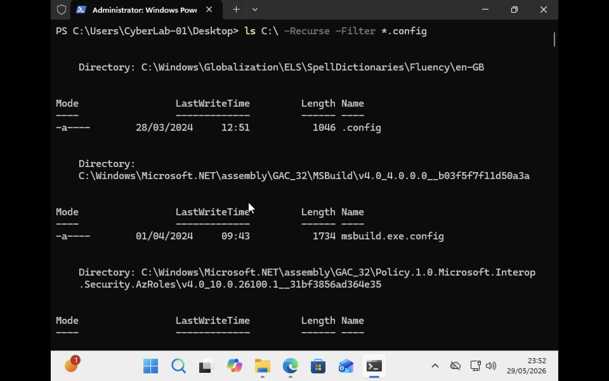
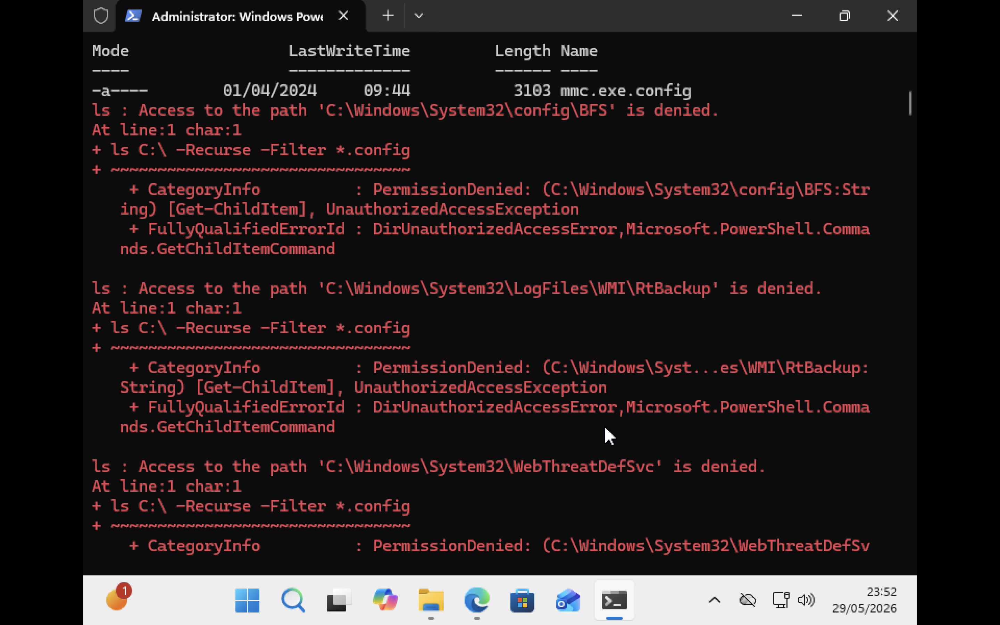
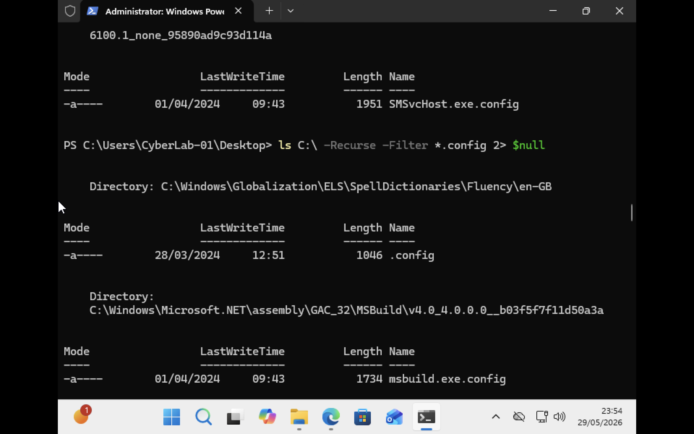

# Windows: Input, Output and Pipelines
### `>`

The greater-than symbol (`>`) is a redirection operator. It allows you to redirect command output to a file instead of displaying it on the screen.If the file does not exist, PowerShell automatically creates it and saves the output inside the file.

```powershell
Get-Process > processes.txt
```
The command above saves the output of `Get-Process` into a file named `processes.txt`.
#### Troubleshooting Example

While following the course, I received an `Access Denied` error when attempting to write to `dog.txt`:
```powershell
echo woof > dog.txt
```

After investigating the issue, I discovered that `dog.txt` had been created as a **directory** rather than a file.
```powershell
Get-Item dog.txt | Format-List Attributes
```

Output:
```text
Attributes : Directory
```

I removed the directory and recreated `dog.txt` as a text file:
```powershell
rm dog.txt -Recurse
echo woof > dog.txt
cat .\dog.txt
```

Output:
```text
woof
```
The command then worked successfully and the file contents were displayed.



### `>>`
`>` it overwrites the existing content with the given output. To avoid overwriting we use `>>` append operator it adds given output to the file without overwriting the previous content. Append additional content:
'''powershell
echo belt >> dog.txt
```
Display the contents of the file:
```cat .\dog.txt
```
Output:
```woof
belt
```
The `>>` operator preserves the existing content and adds new text to the end of the file.


### `Pipes and Filtering Output`

The pipe operator (`|`) sends the output of one command as input to another command. The output of cat dog.txt becomes the input of Select-String lt


```powershell
cat dog.txt | Select-String lt
```

Output:

```text
belt
salt
melt
```

This command displays only the lines that contain the text `lt`. The next command will overwrite the output of Select-String lt into a new file lt_words.txt.
```powershell
cat dog.txt | Select-String lt > lt_words.txt
```
So we can use several simple tools and ​combine them together to do complex tasks.

Mistakenly i wrote the file name incorrect that's why there was an error while displaying the output into a new file lt_words.txt.


### PowerShell Streams and Error Redirection

PowerShell uses different streams to separate normal output, errors, warnings, and debugging information.
| Stream | Meaning                          |
| ------ | -------------------------------- |
| `1>`   | Standard Output (Success Output) |
| `2>`   | Error Output                     |
| `3>`   | Warning Output                   |
| `4>`   | Verbose Output                   |
| `5>`   | Debug Output                     |

By default, success output is displayed on the screen, while errors are shown in red.


#### Redirecting Errors to a File (`2>`)

The `2>` operator redirects error messages to a file instead of displaying them on the console.

Example:

```powershell
cat missing-file.txt 2> errors.txt
```

In this example, the file does not exist, so PowerShell generates an error. Instead of displaying the error on screen, it is written to `errors.txt`.




#### Why Error Redirection is Useful

When searching large directories recursively, PowerShell may encounter protected system folders and generate numerous "Access Denied" messages.

Example:

```powershell
ls C:\ -Recurse -Filter *.config
```

This command searches the entire C: drive for `.config` files.



As PowerShell scans protected directories, it may produce permission errors.




#### Using `$null` to Suppress Errors

`$null` represents an empty value in PowerShell.

Errors can be discarded by redirecting them to `$null`:

```powershell
ls C:\ -Recurse -Filter *.config 2> $null
```

This command displays valid search results while hiding all error messages.



#### Main points

* `>` redirects standard output (stream 1).
* `2>` redirects error output (stream 2).
* `$null` discards unwanted output.
*
