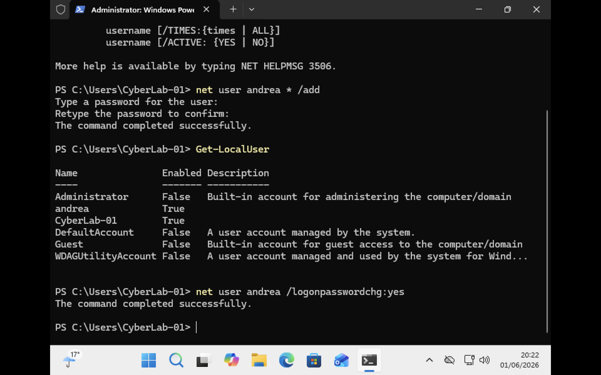
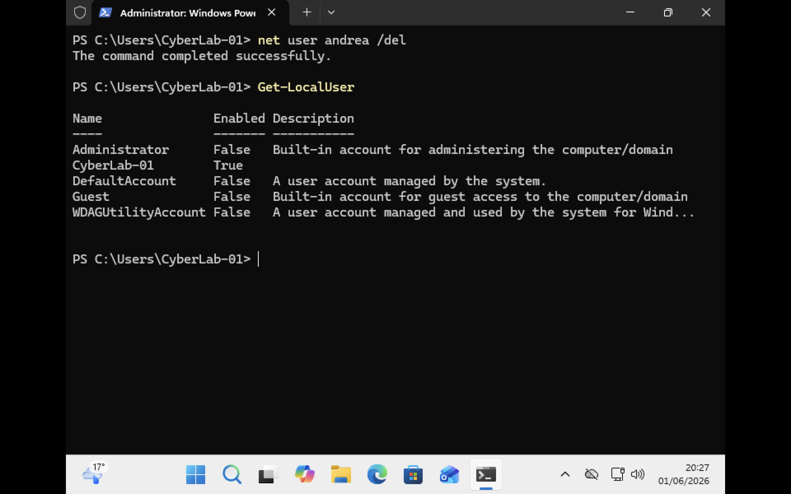
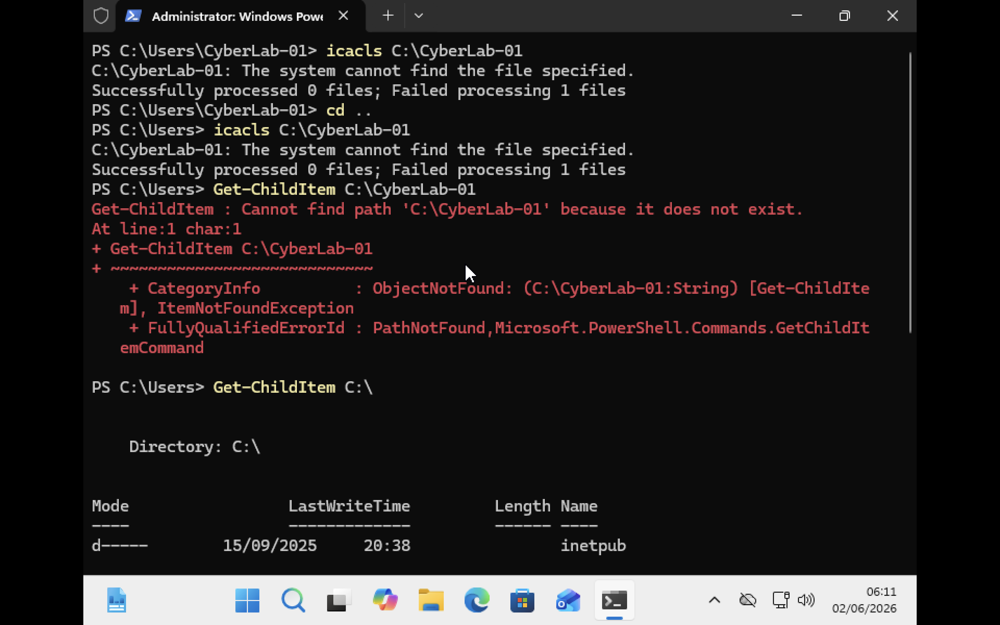
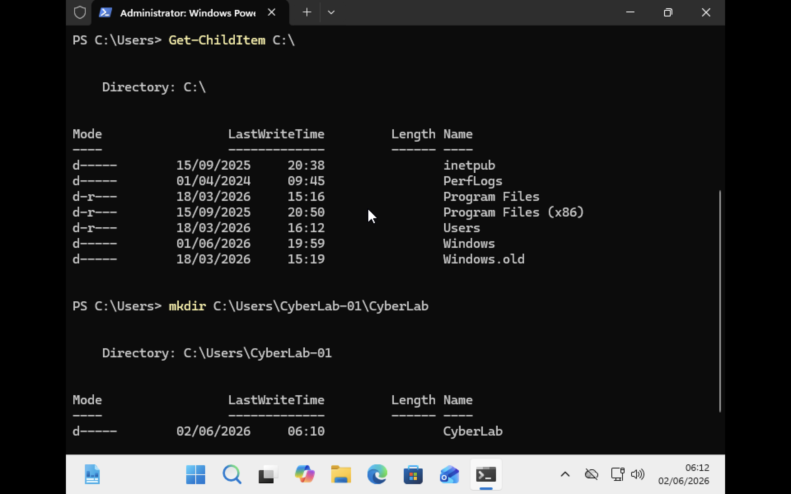
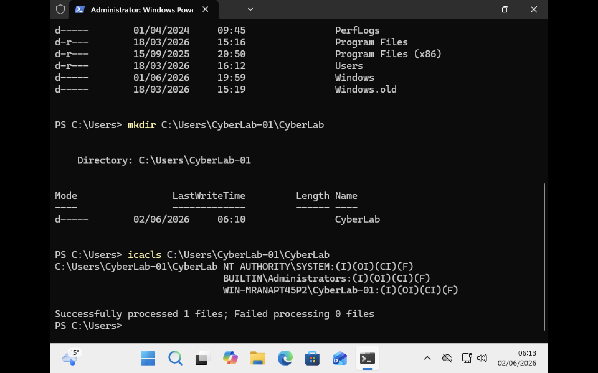
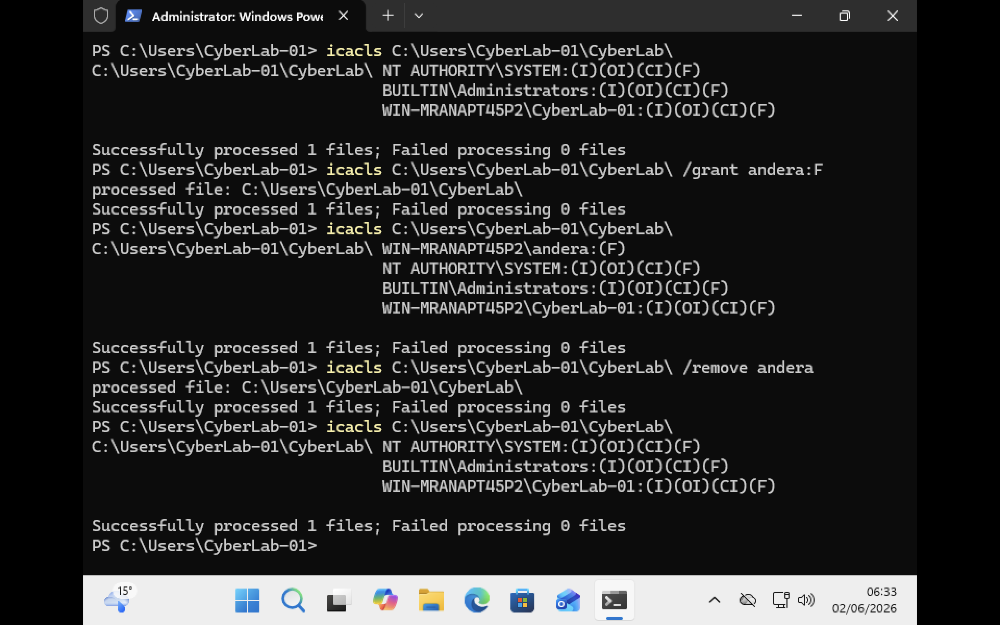

#  View User and Group Information 
### Users and Administrators

Windows uses user accounts and groups to control access to system resources.

- **Standard User** accounts can use applications and access their own files but have limited permissions to modify system settings.
- **Administrator** accounts have elevated privileges and can install software, manage users, change security settings, and perform system-wide administrative tasks.

The `Get-LocalUser` command displays local user accounts, while `Get-LocalGroup` displays security groups used to assign permissions and privileges.


# Managing Local User Passwords with PowerShell
Windows provides several methods for managing local user accounts and passwords. One of the simplest methods is the `net user` command, which can be used from PowerShell or Command Prompt.

### Changing a Password Directly

The following command changes the password of a local user account:

```powershell
net user CyberLab-01 NewPassword123!
```
* `net user` is used to manage local user accounts.
* `CyberLab-01` is the username.
* `NewPassword123!` becomes the new password.

While this method is simple, it is not recommended because the password is visible on the screen and may be stored in command history.

### Using an Asterisk (*) for Secure Password Entry

A more secure method is to use an asterisk (`*`).

```powershell
net user CyberLab-01 *
```
After running the command, Windows prompts for a password:

```text
Type a password for the user:
Retype the password to confirm:
```
The password is not displayed while typing.

### Modern PowerShell Approach

PowerShell also provides dedicated cmdlets for managing local user accounts.

```powershell
Set-LocalUser -Name "CyberLab-01" -Password (Read-Host -AsSecureString)
```

- `Set-LocalUser` is a PowerShell cmdlet used to modify local user accounts.
- `-Name "CyberLab-01"` specifies the local user account that will be updated.
- `Read-Host -AsSecureString` prompts the administrator to enter a password without displaying it on the screen.
The entered password is stored as a SecureString, which helps protect sensitive information in memory. The password entered through Read-Host is passed directly to the -Password parameter of Set-LocalUser. When the command runs, PowerShell prompts for a new password. After the password is entered, the local account CyberLab-01 is updated with the new password without exposing it in the command line or command history.

#### Benefits
* Uses PowerShell-native account management.
* Supports secure password input.
* Better suited for automation and administration scripts.
* Commonly used by system administrators.

# Managing Local User Accounts with PowerShell

Windows administrators can use the `net user` command to create, modify and remove local user accounts. This functionality is used in system administration, user management and security operations.

### ` net` Creating a Local User Account

The following command creates a new local user account naming andrea and prompts for a password securely:

```powershell
net user andrea * /add
```
* `net user` manages local user accounts.
* `andrea` is the username being created.
* `*` prompts for a password without displaying it.
* `/add` creates the account.

The account can be verified using:

```powershell
Get-LocalUser
```


**Figure 2:** Creating a local user account and verifying its creation using `Get-LocalUser`.

### `/logonpasswordchg:yes` Requiring a Password Change at Next Logon

Administrators can require a user to change their password when they first sign in. So new users can choose their own password.

```powershell
net user andrea /logonpasswordchg:yes
```

### Deleting a Local User Account

A local user account can be removed using:

```powershell
net user andrea /del
```
* `/del` removes the specified local user account. The account can be verified as removed using:

```powershell
Get-LocalUser
```



**Figure 3:** Deleting a local user account and confirming its removal from the system.

## Cybersecurity Relevance

User account management is a fundamental administrative task. Security teams frequently review user accounts, enforce password policies, remove inactive accounts and verify access privileges to reduce the risk of unauthorized access.


# Windows Permissions and Access Control

Windows uses Access Control Lists (ACLs) to determine which users and groups can access files, folders and other system resources. Permissions help to protect data from unauthorized access and modification.

### Access Control Lists (ACLs)

An Access Control List (ACL) is a collection of access control entries (ACEs) that define which users or groups can perform specific actions on an object. ACLs are attached to resources such as:
* Files
* Folders
* Registry keys
* Printers
* Active Directory objects

### Two types of ACLs:

* Discretionary Access Control Lists (DACLs)
* System Access Control Lists (SACLs)


### Discretionary Access Control Lists (DACLs)

A DACL determines who is allowed or denied access to a resource. If a user does not have the appropriate permissions defined in the DACL than the access to the resource will be denied. Examples of permissions controlled by a DACL include:

* Read
* Write
* Modify
* Execute
* Full Control

A folder may allow:
* Administrators: Full Control
* Users: Read and Execute
* Guests: No Access
  
### System Access Control Lists (SACLs)

A SACL is used for auditing and monitoring access to resources. SACL records security events. These events can be reviewed in the Windows Event Viewer and are useful for security monitoring and incident investigations. Security events such as:

* Successful access attempts
* Failed access attempts
* File modifications
* Permission changes

#### Cybersecurity Relevance
SACLs help security teams:

* Detect unauthorized access attempts
* Monitor sensitive files
* Investigate security incidents
* Support compliance and auditing requirements

## Viewing Permissions with `icacls`
Windows provides the `icacls` command to display and manage file and folder permissions.

```powershell
icacls C:\Users\CyberLab-01\CyberLab
```

```text
C:\CyberLab BUILTIN\Administrators:(F)
            Users:(RX)
            SYSTEM:(F)
```

## Common ICACLS Permission Flags

| Flag | Meaning |
|--------|---------|
| F | Full Control |
| M | Modify |
| RX | Read and Execute |
| R | Read |
| W | Write |
| I | Inherited Permission |
| OI | Object Inherit (Files) |
| CI | Container Inherit (Folders) |


### Cybersecurity Relevance

Understanding ACLs is important for cybersecurity professionals because misconfigured permissions are a common cause of security incidents.

Proper permission management helps:

* Enforce the principle of least privilege
* Protect sensitive data
* Reduce insider threats
* Limit unauthorized access
* Improve security monitoring and auditing

## Managing Permissions with ACLs and ICACLS

The `icacls` command is used to view and manage file and folder permissions from PowerShell or Command Prompt.

### 1. Common Path Error

```powershell
icacls C:\CyberLab-01
```

This command failed because the folder `C:\CyberLab-01` did not exist.



**Figure 4:** `icacls` returns an error when the specified file or folder path does not exist.


### 2. Creating a Test Folder

To safely practise permissions, I created a test folder inside the user profile:

```powershell
mkdir C:\Users\CyberLab-01\CyberLab
```



**Figure 5:** Creating a test folder called `CyberLab` for permission management practice.


### 3. Viewing Folder Permissions

The following command displays the current permissions on the folder:

```powershell
icacls C:\Users\CyberLab-01\CyberLab
```



**Figure 6:** Viewing existing ACL permissions on the `CyberLab` folder using `icacls`.

### 4. Granting and Removing Permissions

The following command grants Full Control permission to the user `andera`:

```powershell
icacls C:\Users\CyberLab-01\CyberLab\ /grant andera:F
```

The permissions can be checked again using:

```powershell
icacls C:\Users\CyberLab-01\CyberLab\
```

The following command removes the explicit permission assigned to `andrea`:

```powershell
icacls C:\Users\CyberLab-01\CyberLab\ /remove andera
```



**Figure 7:** Granting Full Control permission to a user and then removing the permission using `icacls`.

### Key Learning

This exercise helped me understand how Windows manages file and folder permissions using ACLs. I practised viewing permissions, granting access to a user, removing access and troubleshooting path errors. This is important in cybersecurity because incorrect permissions can expose sensitive files or allow unauthorized access.

