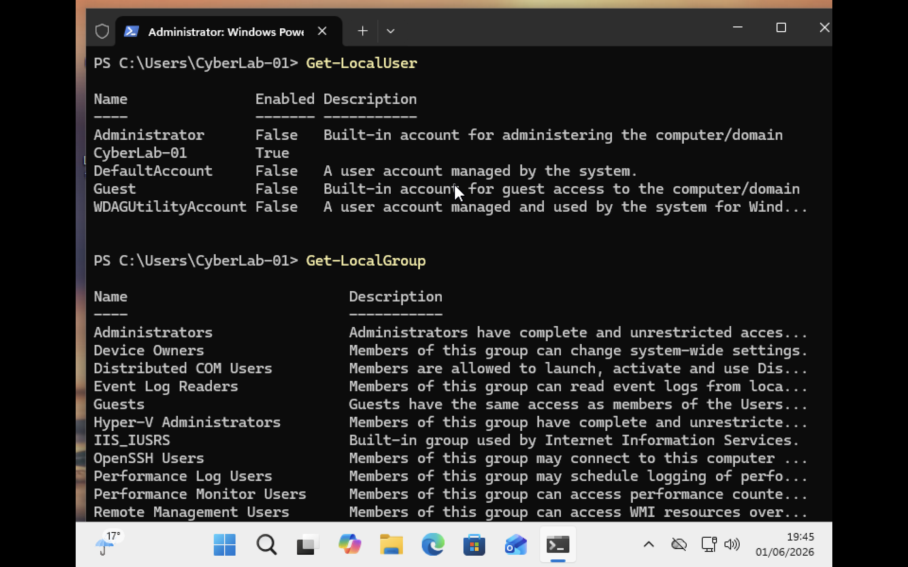

#  View User and Group Information 
### Users and Administrators

Windows uses user accounts and groups to control access to system resources.

- **Standard User** accounts can use applications and access their own files but have limited permissions to modify system settings.
- **Administrator** accounts have elevated privileges and can install software, manage users, change security settings, and perform system-wide administrative tasks.

The `Get-LocalUser` command displays local user accounts, while `Get-LocalGroup` displays security groups used to assign permissions and privileges.


# Managing Local User Passwords with PowerShell
Windows provides several methods for managing local user accounts and passwords. One of the simplest methods is the `net user` command, which can be used from PowerShell or Command Prompt.

### Changing a Password Directly

The following command changes the password of a local user account:

```powershell
net user CyberLab-01 NewPassword123!
```
* `net user` is used to manage local user accounts.
* `CyberLab-01` is the username.
* `NewPassword123!` becomes the new password.

While this method is simple, it is not recommended because the password is visible on the screen and may be stored in command history.

### Using an Asterisk (*) for Secure Password Entry

A more secure method is to use an asterisk (`*`).

```powershell
net user CyberLab-01 *
```
After running the command, Windows prompts for a password:

```text
Type a password for the user:
Retype the password to confirm:
```
The password is not displayed while typing.

### Modern PowerShell Approach

PowerShell also provides dedicated cmdlets for managing local user accounts.

```powershell
Set-LocalUser -Name "CyberLab-01" -Password (Read-Host -AsSecureString)
```

- `Set-LocalUser` is a PowerShell cmdlet used to modify local user accounts.
- `-Name "CyberLab-01"` specifies the local user account that will be updated.
- `Read-Host -AsSecureString` prompts the administrator to enter a password without displaying it on the screen.
The entered password is stored as a SecureString, which helps protect sensitive information in memory. The password entered through Read-Host is passed directly to the -Password parameter of Set-LocalUser. When the command runs, PowerShell prompts for a new password. After the password is entered, the local account CyberLab-01 is updated with the new password without exposing it in the command line or command history.

#### Benefits
* Uses PowerShell-native account management.
* Supports secure password input.
* Better suited for automation and administration scripts.
* Commonly used by system administrators.


