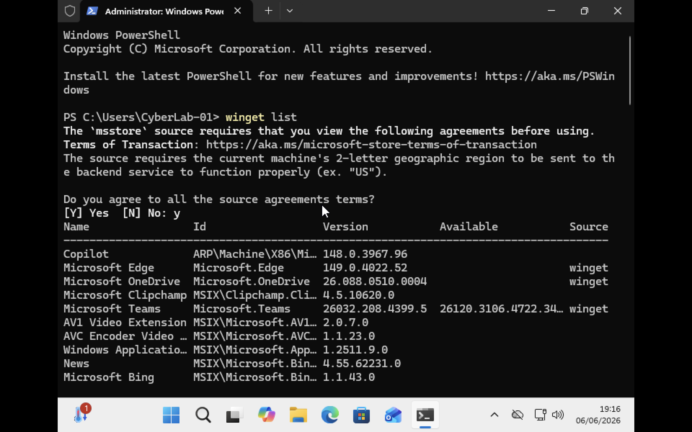
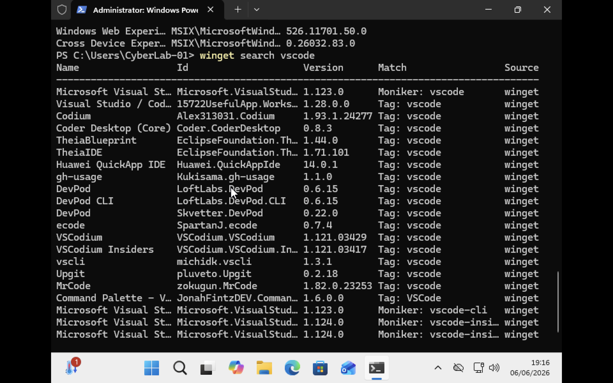
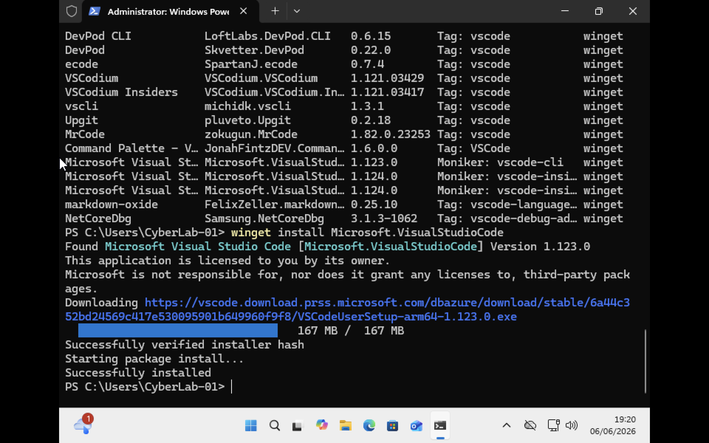
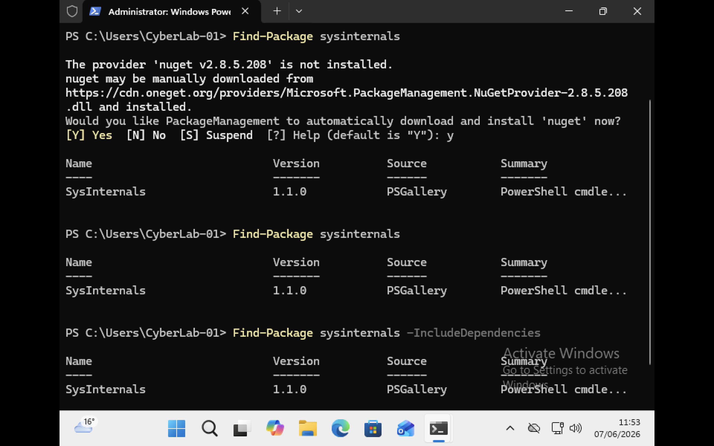

# Windows Package Management

Package management refers to the process of installing, updating and removing software from a system. Windows provides several methods for managing software, including graphical installers and command-line tools.

Common software installation files in Windows include:

```text
.exe
.msi
```

### EXE Installers

Executable (`.exe`) files are the most common installation packages used in Windows. EXE installers typically provide a setup wizard that guides users through the installation process.

Examples:

```text
ChromeSetup.exe
VSCodeSetup.exe
Wireshark.exe
```

### MSI Installers

MSI (Microsoft Installer) files provide a standardized installation format for Windows applications. MSI packages are commonly used in enterprise environments because they support automated deployment and management.
For Example:
```text
Wireshark.msi
ZoomInstaller.msi
``` 
## `Winget` command

Windows Package Manager (Winget) is a command-line tool used to install, update and remove software.

#### Display Installed Software

```powershell
winget list
```

Displays software currently installed on the system.



*Figure 1: Displaying installed software using the `winget list` command.*


#### Search for Software

```powershell
winget search vscode
```

Searches for software packages available in the Winget repository.



*Figure 2: Searching for available software packages using Winget.*

#### Install Software

```powershell
winget install Microsoft.VisualStudioCode
```

Installs Visual Studio Code.



*Figure 3: Installing software using the `winget install` command.*


#### Remove Software

```powershell
winget uninstall Microsoft.VisualStudioCode
```

Removes Visual Studio Code from the system.

# Package Dependencies, DLLs, Shared Code, and Side-by-Side (SxS)

### Package Dependencies

Many applications require additional software components to function correctly. These required components are known as **dependencies**.

Examples include:

* Microsoft Visual C++ Redistributables
* .NET Framework
* .NET Runtime
* DirectX Components

If a required dependency is missing, an application may fail to install or run correctly.
### Dynamic Link Libraries (DLLs)

Windows applications often use **Dynamic Link Libraries (DLLs)**. A DLL contains code and functions that can be shared by multiple applications.

Examples:

```text
kernel32.dll
user32.dll
ntdll.dll
```

Benefits of DLLs:

* Reduce duplication of code.
* Save disk space.
* Allow multiple programs to share common functionality.
* Simplify software updates.
### Shared Code

Shared code refers to software components used by multiple applications. Both applications can use the same DLL rather than storing separate copies of identical code.

For example:

```text
Application A
        ↓
     Shared DLL
        ↑
Application B
```
### DLL dependencies can be broken when

- Overwriting DLL dependencies -  an application to overwrite the DLL dependency of another app causing the other app to fail. 
- Deleting DLL files
- Applying upgrades or fixes to DLLs can cause a problem called “DLL hell” where an application installs a new version of the shared DLL for a computer system.
- Rolling back to previous DLL versions - A user may try to reinstall an older application that stopped working after a shared DLL file was upgraded by a newer app. this reinstallation of the app that uses the old DLL version can overwrite the new DLL file. This DLL version roll back can cause the newer app with the shared DLL dependency to fail the next time it tries to run.
### Fixing DLL problems

#### Side-by-Side Assemblies (SxS)

Microsoft introduced **Side-by-Side (SxS)** technology to reduce DLL conflicts. Instead of forcing applications to share a single DLL version, Windows can store multiple versions simultaneously.

For Example:

```text
Application A → DLL Version 1
Application B → DLL Version 2
```

Both applications continue to function because each uses the version it was designed for.

The Side-by-Side component store is located in:

```text
C:\Windows\WinSxS
```
#### .NET Assemblies and the Global Assembly Cache (GAC)

An assembly is the basic building block of a .NET application. It contains compiled code, metadata, version information, and resources required by an application.

Assemblies are commonly stored as:

- `.dll` files
- `.exe` files

Examples:

```text
System.dll
System.Core.dll
Application.exe
```
their location is following **C:\Windows\Microsoft.NET\assembly** 

#### Difference Between .NET Assemblies and Side-by-Side (SxS)

.NET assemblies are reusable software components used by .NET applications. Shared assemblies can be stored in the Global Assembly Cache (GAC) so that multiple applications can use the same code.

Side-by-Side (SxS) is a Windows technology that allows multiple versions of the same component or DLL to exist on a system at the same time. This helps prevent compatibility issues known as DLL Hell.
# Package Manager
A package manager is a tool used to install, update, configure, and remove software from a system. Instead of manually downloading software from websites, a package manager can automate the process using simple commands. 
Windows PowerShell includes **PackageManagement**, a framework that allows software packages to be discovered, installed, updated, and removed from different package sources.
Common package sources include:
- Chocolatey
- NuGet
- PowerShell Gallery
Package managers help administrators:
* Install software
* Update software
* Remove software
* Manage software dependencies
* Automate software deployment


### Finding Packages

To search for a package i run following command. This command searches configured package sources and returns information about matching packages.

```powershell
Find-Package sysinternals
```

### Viewing Dependencies


Dependencies are additional software components required for a package to function correctly. To search for a package and display any dependencies i run following command.

```powershell
Find-Package sysinternals -IncludeDependencies
```
During this lab I installed the **NuGet provider**. Package providers act as intermediaries between PackageManagement and package repositories.




### Understanding Find-Package and Get-Package

During my lab practice I discovered that finding a package does not mean it is installed.

```powershell
Find-Package sysinternals
```

### Installing Packages

PackageManagement downloads and installs the selected package from the configured source. I run following command To install a package:

```powershell
Install-Package -Name sysinternals
```


## Other Package Managers
### Chocolatey Package Manager

Chocolatey is a popular third-party package manager for Windows. Chocolatey allows administrators to manage software entirely from PowerShell.

Official website:

```text
https://chocolatey.org
```
### Common Commands

Search for a package:

```powershell
choco search wireshark
```

Install a package:

```powershell
choco install wireshark
```

Upgrade a package:

```powershell
choco upgrade wireshark
```

Remove a package:

```powershell
choco uninstall wireshark
```


