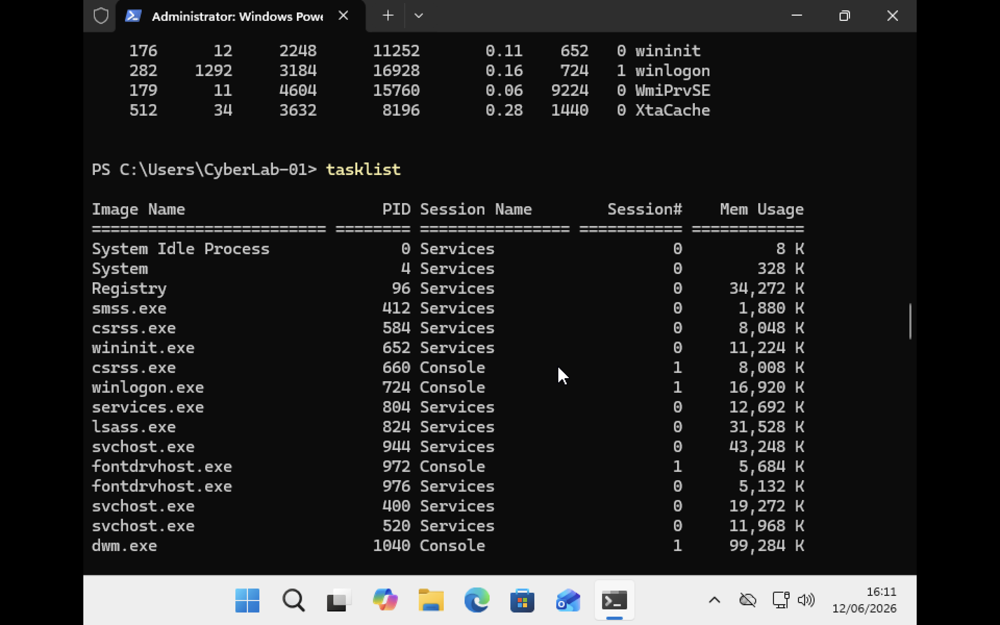
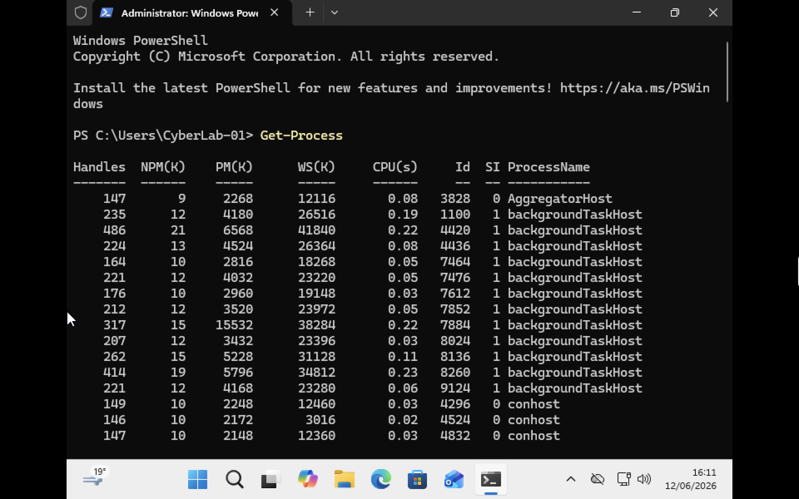

# Windows Process Management

**A process** is an instance of a running program. When an application is launched, the operating system creates a process to execute the program. For example notepad, google chrome and microsoft word each running application has its own process.

## Windows Startup Processes

When Windows starts, several important system processes are created.

### Session Manager Subsystem (smss.exe)

The Session Manager Subsystem (`smss.exe`) is one of the first non kernel and user mode that starts as ​the Session Manager Subsystem or smss.exe. ​.The smss.exe process is ​in charge of setting some stuff up for the OS to work. Such as
* Initializing system sessions
* Setting up the operating environment
* Starting critical system processes

### Windows Logon Process (winlogon.exe)

The `winlogon.exe` process manages:
* User logon and logoff
* User authentication
* Secure attention sequence (Ctrl + Alt + Delete)

### Client Server Runtime Subsystem (csrss.exe)

The `csrss.exe` process is responsible for:

* Console windows
* Command-line operations
* Parts of the Windows graphical environment

## Verifying Windows Startup Processes

The course introduced several important Windows startup processes including:

- smss.exe
- csrss.exe
- winlogon.exe

I verified these processes using the `tasklist` command.



The screenshot shows these processes actively running on my Windows virtual machine, demonstrating how Windows initializes and manages critical system components after startup.
Windows starts several important processes during boot that also noticed in the screenshot as well.

| Process        | Purpose                         |
| -------------- | ------------------------------- |
| `smss.exe`     | Session Manager Subsystem       |
| `csrss.exe`    | Client Server Runtime Subsystem |
| `winlogon.exe` | User Logon Process              |
| `services.exe` | Starts Windows Services         |
| `lsass.exe`    | Local Security Authority        |
| `svchost.exe`  | Hosts Windows Services          |
| `dwm.exe`      | Desktop Window Manager          |

## Viewing Processes with PowerShell
PowerShell provides the `Get-Process` cmdlet to display currently running processes.
```cmd
Get-Process
```
The output includes information such as process name, PID, CPU usage, memory usage and handles.

## Parent and Child Processes

Windows creates processes using a parent child relationship.

Example:

```text
PowerShell
    │
    └── Notepad
```

If PowerShell launches Notepad:

* PowerShell becomes the parent process.
* Notepad becomes the child process.

The child process inherits some information from the parent, such as environment settings.


## Process Independence

Unlike Linux, Windows child processes can continue running even if the parent process is terminated.

Example:

```text
PowerShell → Launches Notepad
        ↓
PowerShell Closed
        ↓
Notepad Continues Running
```

## Process IDs (PID)

Every process running in Windows is assigned a unique Process ID (PID).

Administrators use PIDs to identify and manage processes.


## Stopping Processes

### Task Manager

Processes can be terminated using Task Manager.

### Taskkill Command

Windows provides the `taskkill` utility to stop processes from the command line.

Terminate a process using its PID:

```cmd
taskkill /PID 1234
```


