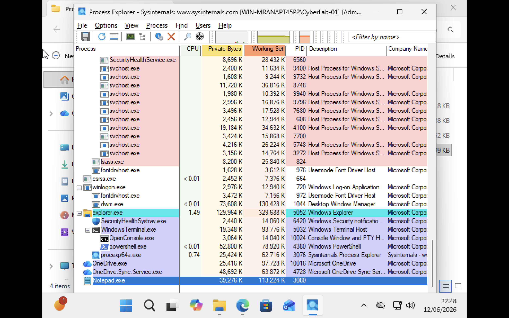
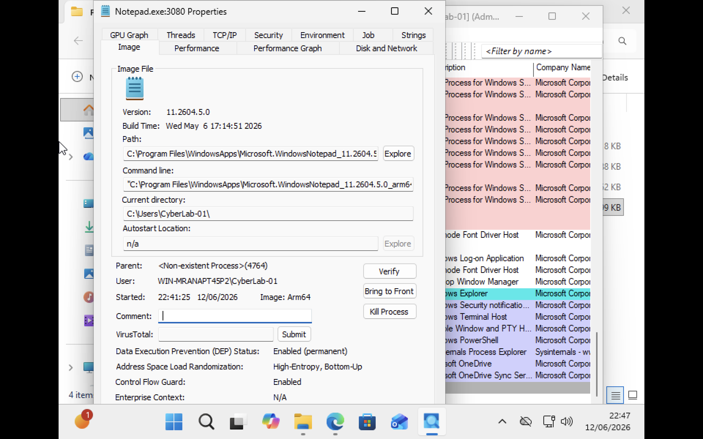
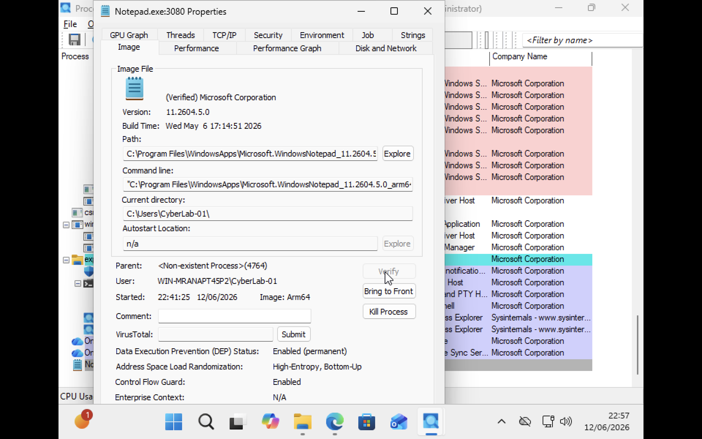
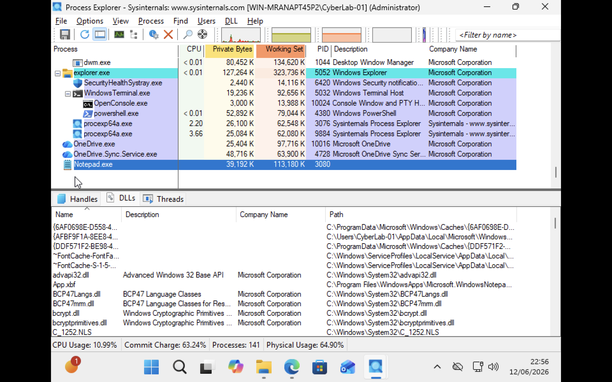

# Windows: Process Explorer Analysis

This lab demonstrates how to use Microsoft's Sysinternals Process Explorer to investigate running processes, examine parent-child relationships, verify digital signatures and inspect DLL dependencies. Process Explorer provides significantly more detail than Task Manager and is commonly used by system administrators, troubleshooters and security analysts.

## Viewing Process Hierarchy

Process Explorer displays processes in a tree structure, making it easier to understand parent child relationships. In this lab I launched Notepad using PowerShell.

```powershell
notepad.exe
```

When Notepad was created, PowerShell acted as the parent process.

```text
powershell.exe
└── notepad.exe
```

But Process Explorer displayed following,

```text
Parent: <Non-Existent Process>
```

This indicates that the original parent process recorded during creation is no longer running. Because i terminated the powershell. Windows assigns a Parent Process ID (PPID) when a process is created. If the parent process terminates the child process continues running independently. Process Explorer still remembers the original PPID, but because thatparent process was terminated therefore it displays:

```text
<Non-Existent Process>
```

This demonstrates an important Windows process management concept: after creation, child processes can continue running even if their parent process has terminated. 
### Important Concept

Unlike Linux, Windows processes are generally independent after creation.

The child process does not automatically terminate when its parent exits.

This behavior demonstrates how Windows process management differs from Linux process management.

### Screenshot



### What I Observed

- `explorer.exe` acts as the Windows shell.
- User applications are often launched from Explorer.
- Process Explorer displays parent-child relationships using a tree view.
- Every process has a unique Process ID (PID).
- Windows processes inherit information from their parent during creation.

## Investigating Notepad.exe

I opened the properties of Notepad.exe to inspect detailed process information.

### Screenshot



### Information Available

- Executable path
- Process ID (PID)
- User account
- Command line
- Current directory
- Security protections
- Parent process information

### Security Features Observed

- DEP (Data Execution Prevention)
- ASLR (Address Space Layout Randomization)
- Digital Signature Verification

These protections help defend applications from common memory exploitation attacks.


## Verifying Digital Signatures

Process Explorer can verify whether an executable was signed by a trusted publisher.

### Screenshot



### Observation

The Notepad executable was verified as:

```text
Microsoft Corporation
```

Digital signatures help verify:

- Software authenticity
- Software integrity
- Trusted software publishers

This helps administrators identify potentially malicious executables.


## Examining DLL Dependencies

Process Explorer can display DLLs loaded by a process.

### Screenshot



### Examples Observed

```text
advapi32.dll
bcrypt.dll
bcryptprimitives.dll
BCP47Langs.dll
```

DLLs (Dynamic Link Libraries) contain reusable code that applications can share.

Benefits include:

- Reduced disk usage
- Reduced memory usage
- Code reuse across applications
- Easier software maintenance

### Dependency Concept

Applications often depend on multiple DLLs.

Example:

```text
Notepad.exe
├── advapi32.dll
├── bcrypt.dll
├── kernel32.dll
└── user32.dll
```

If a required DLL is missing or incompatible, the application may fail to start.

This issue is commonly known as:

```text
DLL Dependency Problems
```

or

```text
DLL Hell
```
## Resource Monitoring

Process Explorer can be used to monitor resource consumption by running processes.
Resources such as following,

- CPU Usage: Processor time consumed by a process.
- Working Set: Physical memory currently assigned to a process.
- Private Bytes: Memory allocated exclusively to a process.
- PID: Unique Process Identifier.

These metrics help administrators identify resource intensive applications and troubleshoot performance issues.

## Why Process Explorer Is Useful

Compared with Task Manager, Process Explorer provides:

- Process hierarchy visualization
- Parent-child relationships
- DLL dependency inspection
- Handle inspection
- Digital signature verification
- Security information
- Detailed process properties

These capabilities make Process Explorer a valuable troubleshooting and security analysis tool.


## What I Learned

- Windows processes have parent-child relationships.
- Processes receive an environment from their parent during creation.
- Child processes can continue running even if their parent exits.
- Process Explorer provides more information than Task Manager.
- Digital signatures help verify executable authenticity.
- DLLs provide reusable shared code.
- Applications rely on DLL dependencies to function correctly.
- Process Explorer can display loaded DLLs and process relationships.
- A "Non-Existent Parent" means the original parent process has already terminated, not that the process was created without a parent.
