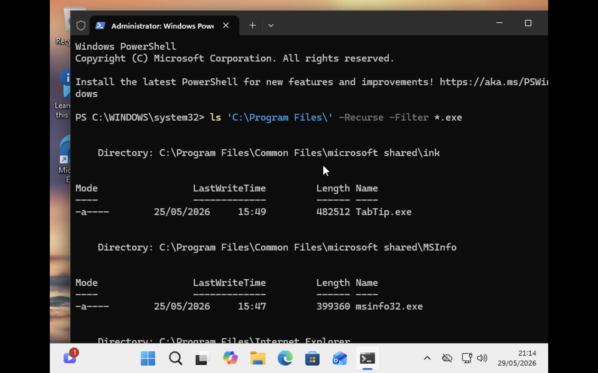

# Windows PowerShell Commands

Basic Windows PowerShell commands and shortcuts from the Coursera course.


## Navigation Commands

### `ls`

Displays the list of files and folders in the current directory.

```powershell
ls
```

### Show Hidden Files

```powershell
ls -Force
```

### Get Help for `ls`

```powershell
Get-Help ls
```

Displays a brief description of the command.

### Full Help Documentation

```powershell
Get-Help ls -Full
```

Displays detailed information about all parameters.


### `pwd`

Shows the current working directory.

```powershell
pwd
```

### `cd`

Changes the current directory.

```powershell
cd foldername
```

#### Move One Level Up

```powershell
cd ..
```

#### Go to Home Directory

```powershell
cd ~
```

`~` is a shortcut for your home directory.


## Directory Management

### `mkdir`

Creates a new directory.

```powershell
mkdir myFolder
```

### Create Folder Names with Spaces

PowerShell does not interpret spaces automatically, so use quotes or escape spaces.

```powershell
mkdir 'my cool folder'
```

or

```powershell
mkdir my` cool` folder
```

## Screen Management

### `clear`

Clears the terminal screen.

```powershell
clear
```


## Copy Files and Directories

### `cp`

Copies files and folders.

#### Copy a File

```powershell
cp mycoolfile.txt C:\Users\effa\Desktop\
```

#### Copy Multiple Files Using Wildcards

```powershell
cp *.jpg C:\Users\effa\Desktop\
```

Copies all `.jpg` files to the specified directory.

#### Copy a Folder

```powershell
cp 'my cool folder' C:\Users\effa\Desktop\
```

#### Copy a Folder with All Contents

```powershell
cp 'my cool folder' C:\Users\effa\Desktop\ -Recurse
```

`-Recurse` copies all files and subfolders inside the directory.


## Move and Rename Files

### `mv`

Moves or renames files and folders.

#### Rename a File

```powershell
mv .\blue-document.txt yellow-document.txt
```

Renames `blue-document.txt` to `yellow-document.txt`.

#### Move a File

```powershell
mv .\yellow-document.txt C:\Users\effa\Desktop\
```

Moves the file to the specified location.

#### Move Multiple Files

```powershell
mv *-document.txt C:\Users\effa\Desktop\
```

Moves all files ending with `-document.txt`.


## Remove Files and Directories

### `rm`

Deletes files and folders.

#### Remove a File

```powershell
rm yellow-document.txt
```

#### Remove a Directory and Its Contents

```powershell
rm -Recurse myFolder
```

`-Recurse` removes the folder and everything inside it.


## Read File Contents

### `cat`

Displays the contents of a file.

```powershell
cat .\important_doc.txt
```

`cat` stands for **concatenate**.
#### `more`
more command will get the contents of the file, ​but will pause once it fills the terminal window.
```powershell
more .\important_doc.txt
```
we can use different keys for to read file further **The Enter key** advances the file by one line. ​​**Space** advances the file by one page.  ​The **Q key** allows you to ​quit out of more and go back to your shell.

#### `Head`
head command will give the first few lines of the file you want to see.
```powershell
cat .\important_doc.txt -Head 10
```
This will show us the first 10 lines of a file.

#### `Tail`
tail command give last lines of file.
```powershell
cat .\important_doc.txt -Tail 10
```

This will show the last 10 lines of a file. 

## Searching With in File
### `Select-Search`
This command search for ​text that matches a pattern you provide. ​This could be a word, part of a word, a phrase or more complicated patterns that ​are described using a pattern matching language called **regular expressions.**
```powershell
Select-Search cow farm.txt
```
Select-String found cow and it tells you the file and ​line number where it found it.  wildcard character asterisk (*) ​we can use that here to search anything in all the files at once.
```powershell
​Select-Search cow *.txt
```
## Searching Within Directories
### `-Filter`
Filter parameter will filter the results for ​file names that match a pattern. 
```powershell
ls 'C:\Program Files' -Recurse -Filter *.exe
```
This command will give all executable files. The **asterisks** mean match anything and the **.exe** is the file extension for ​executable files in Windows. here is the screenshot of this command taken from window VM. 


## Windows: Input, Output and Pipelines
### `>`

The greater-than symbol (`>`) is a redirection operator. It allows you to redirect command output to a file instead of displaying it on the screen.If the file does not exist, PowerShell automatically creates it and saves the output inside the file.

```powershell
Get-Process > processes.txt
```
The command above saves the output of `Get-Process` into a file named `processes.txt`.


 


